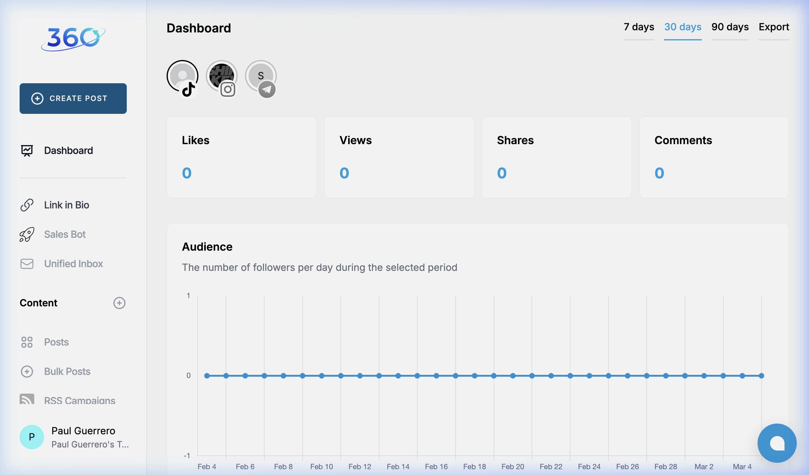
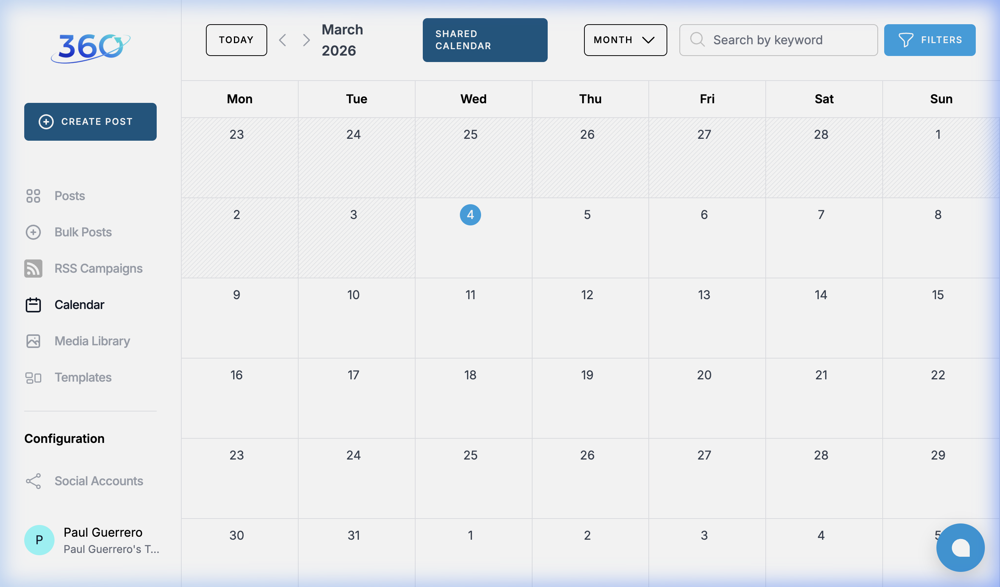
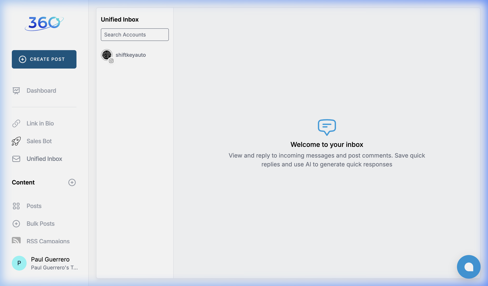

# Content360 UI/UX Reference

This document serves as a visual and functional reference from the Content360 application survey. We can refer back to these patterns as we implement the [UIX_IMPROVEMENTS.md](./UIX_IMPROVEMENTS.md).

## Key Screens

All research screenshots have been saved to `docs/research/content360/`. Below are links to some of the key views:

### Dashboard

*Key Takeaways*: Clean card layout for metrics, audience growth charts, clearly labeled top navigation toggles.

### Calendar

*Key Takeaways*: Clean monthly grid, platform icons on scheduled dates, "Shared Calendar" toggle for team visibility.

### Unified Inbox

*Key Takeaways*: Omnichannel view split by user/account. Has AI-generated quick reply suggestions available when messaging.

---

### General Navigation Takeaways

- **Sidebar Structure:** The sidebar is clearly grouped into Workspaces, Social, Content, and Configuration, keeping the navigation clean despite having many features.
- **Top Bar:** Incorporates search, simple page headers, and persistent contextual actions (like 'Create Post' always accessible when needed).
- **Theme:** Mostly light minimalist background (`#f8f9fa` or similar), with white content cards (`#ffffff`) using soft shadows to create depth.
